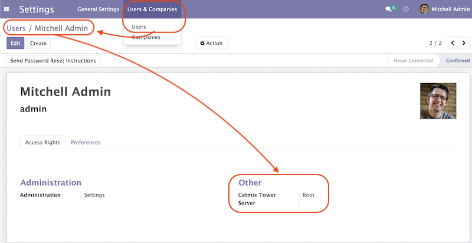
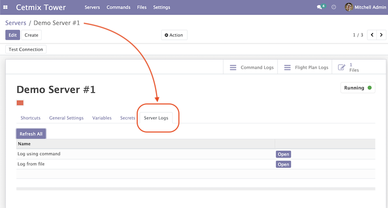

Please ensure that you have read and understood the documentation before running [Cetmix Tower](https://cetmix.com/tower) in the production environment.

## User access configuration

In order for a user to be able to use [Cetmix Tower](https://cetmix.com/tower) features you need to provide access to in the the user settings.
To configure it go to `Setting/Users & Companies/Users` and open a user whom you would like to provide access to the Cetmix Tower.



In `Other` section find the `Cetmix Tower` field and select one of the following options:

- **User**. Members of this group have read access only to the [Servers](#configure-a-server) which they are added as followers.
They also have access to the entities such as [Commands](#configure-a-command),  [Flight Plans](#configure-a-flight-plan) or [Server Logs](#configure-a-server-log) with `Access Level` set to `User`.
- **Manager**. Members of this group can modify [Servers](#configure-a-server) which they are added as followers. They can create new [Servers](#configure-a-server) too however they cannot delete them.
Users of this group have access to the entities with `Access Level` set to `Manager` or `User`.
- **Root**. Members of this group can create, modify or delete any [Server](#configure-a-server). They also have access to the entities with any `Access Level` set.

**NB:** Please keep in mind that some of the entities can have their additional access management variations.


## Configure a Server

Go to the `Cetmix Tower/Servers/Servers` menu and click `Create`.

Enter the server name and fill the values it the tabs below:

### General Settings

- **Partner**: Partner this server belongs to
- **Operating System**: Operating system that runs on the server
- **IPv4 Address**
- **IPv6 Address**: Will be used if no IPv4 address is specified
- **SSH Auth Mode**: Available options are "Password" and "Key"
- **SSH Port**
- **SSH Username**
- **Use sudo**: If sudo is required by default for running all commands on this server
- **SSH Password**: Used if Auth Mode is set to "Password" and for running `sudo` commands with password
- **SSH Private Key**: Used for authentication is SSH Auth Mode is set to "Key"
- **Note**: Comments or user notes

There is a special **Status** field which indicates current Server status. It is meant to be updated automatically using external API with further customizations.
Following pre-defined statuses are available:

- Undefined
- Stopped
- Starting
- Running
- Stopping
- Restarting

Default status is 'Undefined'.

### Variables

Configure variable values to be used when rendering [commands](#configure-a-command) and files on this server.
Check the [Configuring Variables](#configure-variables) section for more details.

### Secrets

Configure secret values to used when rendering commands and files on this server.
Check the [Configuring Keys/Secrets](#configure-a-keysecret) section for more details.

### Server Logs

Configure server logs in order to have convenient access to them.
Logs can be fetched either from [Files](#configure-a-file) or using [Commands.](#configure-a-command)
Check the [Configuring a Server Log](#configure-a-server-log) section for more details.

### Files

Click the "Files" action button to access files that belong to this server.
Check the [Configuring Files](#configure-a-file) section for more details.

## Configure Variables

To configure variables go to the `Cetmix Tower/Settings` and select the `Variables` menu.

### Variables Applicability

[Cetmix Tower](https://cetmix.com/tower) supports `jinja2` syntax for variables. You can use variables to render:

- Commands. Eg `ls -lh {{ file_store_location }}`
- Files. Eg a "Dockerfile" file can have the following text in it: `ODOO_VERSION = {{ odoo_default_version }}`
- File Templates. You can use variables for both file name and file location on server. Eg `File Name` value is `backup_{{ instance_name }}_{{ odoo_db_name }}` and `Directory on server` is `{{ file_cron_location }}`
- Other Variables. Eg for an `odoo_config_location` variable can have a value of `{{ odoo_root}}/conf`

You can use any `jinja2` supported expressions. For example `if else` statements:
```
docker run -d -p {{ odoo_port }}:8069 \

    -p {{ odoo_longpolling_port }}:8072 \

    -v {{ odoo_data }}:/var/lib/odoo \

    -v {{ odoo_config_location }}:/etc/odoo \

```

### Variable Types

Following types of variable values available in [Cetmix Tower](https://cetmix.com/tower):

- Local values. Those are values that are defined at a record level. For example for a server.
- Global values. Those are values that are defined at the [Cetmix Tower](https://cetmix.com/tower) level.

When rendering an expression local values are used first. If no local value is found then global value will be used.
For example default value of the `odoo_port` variable is `8069`. However you can easily specify any other value and thus run multiple Odoo instances on a single server.

**IMPORTANT!**: Storing sensitive data (eg GitHub tokens) in variable values may expose that date in command preview and logs. Use [secrets](#configure-a-keysecret) for storing such data instead.

### 'tower' System Variable

There is a special `tower` variable available which allows to access some system parameters and helper tools.
**Important!** do not redefine the `tower` variable unless you really need that on purpose.

Following system variables are available:

- Server properties
  - `tower.server.name` Current server name
  - `tower.server.username` Current server SSH Username​
  - `tower.server.ipv4` Current server IPv4 Address​
  - `tower.server.ipv6` Current server IPv6 Address​
  - `tower.server.partner_name` Current server partner name

- Helper tools
  - `tower.tools.uuid` Generates a random UUID4
  - `tower.tools.today` Current date
  - `tower.tools.now` Current date time

## Configure a Key/Secret

Keys/Secrets are used to private SSH keys and sensitive data that is used for rendering commands.
To configure a new key or secret go to `Cetmix Tower/Settings/Keys` click `Create` and put values in the fields:

- **Name**: Readable name
- **Key Type**: Following values are available:
  - `SSH Key` is used to store SSH private keys. They are selectable in [Server settings](#configure-a-server)
  - `Secret` used to store sensitive information that can be used inline in commands. Eg a token or a password. Secrets cannot be previewed in command preview and are replaced with placeholder in [command](#configure-a-command) logs.
- **Key ID**: This values will be used for referencing this secret in commands and files
- **Value**: Key value. **IMPORTANT:** This is a write only field. Please ensure that you have saved your key/secret before saving it. Once saved it cannot be read from the user interface any longer.
- **Used For**: `SSH Key` type only. List of [Servers](#configure-a-server) where this SSH key is used
- **Partner**: `Secret` type only. If selected this secret is used only for the [Servers](#configure-a-server) of selected partner
- **Server**: `Secret` type only. If selected this secret is used only for selected [Server](#configure-a-server)
- **Note**: Put your notes here

### Keys of type `Secret`

Keys of type `Secret` (or "Secret") are considered "Global" if no partner and no server are selected. Such keys are accessible all across the Tower.
Global keys are overridden with partner keys with the same reference.
Partner keys in their turn are overridden with server specific keys.
Priority order from highest to lowest is:

1. Server specific
2. Partner specific
3. Global

Secrets are inserted inline in code using the following pattern: `#!cxtower.secret.REFERENCE!#`. It consists of three dot separated parts and is terminated with a mandatory `!#` suffix:
- `#!cxtower` is used to declare a special Tower construction
- `secret` is used to declare its type (secret)
- `REFERENCE` secret id as it's written in the **Key ID** field

**Example:**

Suppose we have a secret with **Key ID** set to `MY_SECRET_DIR` and value `suchMuchFolder`. In this case the following command:
```bash
mkdir /home/#!cxtower.secret.MY_SECRET_DIR!#
```
will be executed as:
```bash
mkdir /home/suchMuchFolder
```

## Configure a File

[Cetmix Tower](https://cetmix.com/tower) is using SFTP protocol for file transfer operations. Based on initial file location following file sources are available:

- Server. These are files that are initially located on remote server and are fetched to [Cetmix Tower](https://cetmix.com/tower). For example log files.

- Tower. These are files that are initially formed in [Cetmix Tower](https://cetmix.com/tower) and are uploaded to remote server. For example configuration files.
Such files are rendered using variables and can be created and managed using file templates.

To create a new file go to `Cetmix Tower/Files/Files` click `Create` and put values in the fields:

- **Name**: Filesystem filename
- **Source**: File source. Available options are `Server` and `Tower`. Check above for more details.
- **File type**: Type of file contents. Possible options:
  - **Text**: Regular text. Eg configuration file or log
  - **Binary**: Binary file. Eg file archive or pdf document
- **File**:  Is used to store binary file data.
- **Template**: File template used to render this file. If selected file will be automatically updated every time template is modified. Used only with `Tower` source.
- **Server**: Server where this file is located
- **Directory on Server**: This is where the file is located on the remote server
- **Full Server Path**: Full path to file on the remote server including filename
- **Auto Sync**: If enabled the file will be automatically uploaded to the remote server on after it is modified in [Cetmix Tower](https://cetmix.com/tower). Used only with `Tower` source.
- **Keep when deleted**: If enabled, file will be kept on remote server after removing it in the Odoo

Following fields are located in the tabs below:

- **Code**: Raw file content. This field is editable for the `Tower` files and readonly for `Server` ones. This field supports [Variables](#configure-variables).
- **Preview**: This is a rendered file content as it will be uploaded to server. Used only with `Tower` source.
- **Server Version**: Current file content fetched from server. Used only with `Tower` source.

**NB**: File operations are performed using user credentials from server configuration. You should take care of filesystem access rights to ensure that file operations are performed without any issues.

### File Templates

File templates are used to create and manage multiple files in bulk. Once a template is modified all related files are automatically updated.

To create a new file template go to `Cetmix Tower/Files/Templates` click `Create` and put values in the fields:

- **Name**: Template name
- **File Name**: Filesystem name of the file(s) created from this template. This field supports [Variables](#configure-variables).
- **Directory on server**: Directory on remote server where this file will be stored. This field supports [Variables](#configure-variables).
- **File type**: Type of file contents. Possible options:
  - **Text**: Regular text. Eg configuration file or log
  - **Binary**: Binary file. Eg file archive or pdf document
- **Tags**: Make usage as search more convenient
- **Note**: Comments or user notes
- **Code**: Raw file content. This field supports [Variables](#configure-variables).
- **Keep when deleted**: If enabled, file(s) created from this template will be kept on remote server after removing it(them) in the Odoo

**Hint**: If you want to create a file from template but don't want further template modifications to be applied to this file remove the value from the `Template` field before saving it.

## Configure a Command

Command is a shell command that is executed on remote server.
To create a new command go to `Cetmix Tower/Commands/Commands` click `Create` and put values in the fields:

- **Name**: Command readable name.
- **Allow Parallel Run**: If disabled only one copy of this command can be run on the same server at the same time. Otherwise the same command can be run in parallel.
- **Note**: Comments or user notes.
- **Servers**: List of servers this command can be run on. Leave this field blank to make the command available to all servers.
- **OSes**: List of operating systems this command is available. Leave this field blank to make the command available for all OSes.
- **Tags**: Make usage as search more convenient.
- **Action**: Action executed by the command. Possible options:
  - `Execute shell command`: Execute a shell command using ssh connection on remote server.
  - `Push file`: Create or update a file using selected file template and push it to remote server. If the file already exists on server it will be overwritten.

- **Default Path**: Specify path where command will be executed. This field supports [Variables](#configure-variables). Important: ensure ssh user has access to the location even if executing command using sudo.
- **Code**: Command code as it will be executed by remote shell. This field supports [Variables](#configure-variables).
- **File Template**: File template that will be used to create or update file. Check [File Templates](#file-templates) for more details.

## Configure a Flight Plan

Flight Plans are used to execute commands in series. They allow to build a flexible condition based execution flow.
To create a new flight plan go to `Cetmix Tower/Commands/Flight Plans` click `Create` and put values in the fields:

- **Name**: Flight Plan name
- **On Error**: Default action to execute when an error happens during the flight plan execution. Possible options:
  - `Exit with command code`. Will terminate the flight plan execution and return an exit code of the failed command.
  - `Exit with custom code`. Will terminate the flight plan execution and return the custom code configured in the field next to this one.
  - `Run next command`. Will continue flight plan execution.
- **Note**: Comments or user notes.
- **Servers**: List of servers this command can be run on. Leave this field blank to make the command available to all servers.
- **Tags**: Make usage as search more convenient.
- **Code**: List of commands to execute. Each of the commands has the following fields:
  - **Sequence**: Order this command is executed. Lower value = higher priority.
  - **Command**: [Command](#configure-a-command) to be executed.
  - **Path**: Specify path where command will be executed. Overrides `Default Path` of the command. This field supports [Variables](#configure-variables).
  - **Use Sudo**: Use `sudo` if required to run this command.
  - **Post Run Actions**: List of conditional actions to be triggered after the command is executed. Each of the actions has the following fields:
    - **Sequence**: Order this actions is triggered. Lower value = higher priority.
    - **Condition**: Uses command exit code.
    - **Action**: Action to execute if condition is met. Possible options:
      - `Exit with command code`. Will terminate the flight plan execution and return an exit code of the failed command.
      - `Exit with custom code`. Will terminate the flight plan execution and return the custom code configured in the field next to this one.
      - `Run next command`. Will continue flight plan execution.

## Configure a Server Log

Server Logs allow to fetch and view logs of a server fast and convenient way.
To configure a Server Log open the server form, navigate to the `Server Logs` tab and add a new record in the list.



Following fields are available:

- **Name**: Readable name of the log
- **Access Level**: Minimum access level required to access this record. Please check the [User Access Settings](#user-access-configuration) section for more details.
Possible options:
  - `User`. User must have at least `Cetmix Tower / User` access group configured in the User Settings.
  - `Manager`. User must have at least `Cetmix Tower / Manager` access group configured in the User Settings.
  - `Root`. User must have `Cetmix Tower / Root` access group configured in the User Settings.
- **Log Type**: Defines the way logs are fetched. Possible options:
  - `Command`. A command is run with its output being saved to the log
  - `File`. Log is fetched from a file
- **Command**: A command that is used to fetched the logs. This option is available only for `Log Type` set to `Command`. Important: please ensure that selected command can be executed multiple times in parallel to avoid any potential issues.
- **Use Sudo**: Use `sudo` if required to run this command.
- **File**: A file that is used to fetch the log.

**Developer hint**: log output supports HTML formatting. You can implement your custom log formatter by overriding the `_format_log_text()` function of the `cx.tower.server.log` model.

## Configuration best practices

### Use simple commands

Try to avoid using `&&` or `;` joined commands unless this is really needed.
Use flight plans instead.

**Why?**

- Simple commands are easier to reuse across multiple flight plans.
- Commands run with `sudo` with password are be split and executed one by one anyway.

**Not recommended:**

```bash
apt-get update && apt-get upgrade -y && apt-get install doge-meme-generator
```

**Way to go:**

```bash
apt-get update
```

```bash
apt-get upgrade -y
```

```bash
apt-get install doge-meme-generator
```

### Do not change directory using shell commands

Do not use `cd` or `chdir` commands.
Use `Default Path` field in command or `Path` field in flight plan line.

**Why?**

- Tower will automatically adjust the command to ensure it is properly executed in the specified location.

**Do not do this:**

```bash
cd /home/{{ tower.server.username }}/memes && cat my_doge_memes.txt
```

**Way to go:**

- Add the following value in the `Default Path` command field or `Path` field of a flight plan line:

```bash
/home/{{ tower.server.username }}/memes
```

- Leave the command code as follows:

```bash
cat my_doge_memes.txt
```
