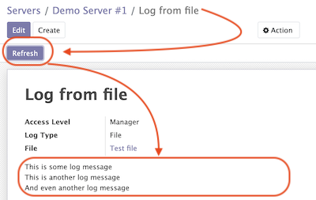

## Running a Command

To run a command:

- Select a server in the list view or open a server form view
- Open the `Actions` menu and click `Execute Command`
- A wizard is opened with the following fields:
  - **Servers**: Servers on which this command will be executed
  - **Tags**: If selected only commands with these tags will be shown
  - **Sudo**: `sudo` option for running this command
  - **Command**: Command to execute
  - **Show shared**: By default only commands available for the selected server(s) are selectable. Activate this checkbox to select any command
  - **Path**: Directory where command will be executed. Important: this field does not support variables! Ensure that user has access to this location even if you run command using sudo.
  - **Code**: Raw command code
  - **Preview**: Command code rendered using server variables.
  **IMPORTANT:** If several servers are selected preview will be rendered for the first one. However during the command execution command code will be rendered for each server separately.

There are two action buttons available in the wizard:

- **Run**. Executes a command using server "run" method and log command result into the "Command Log".
- **Run in wizard**. Executes a command directly in the wizard and show command log in a new wizard window.

You can check command execution logs in the `Cetmix Tower/Commands/Command Logs` menu.
Important! If you want to delete a command you need to delete all its logs manually before doing that.

## Running a Flight Plan

To run a flight plan:

- Select a server in the list view or open a server form view
- Open the `Actions` menu and click `Execute Flight Plan`
- A wizard is opened with the following fields:
  - **Servers**: Servers on which this command will be executed
  - **Tags**: If selected only commands with these tags will be shown
  - **Plan**: Flight plan to execute
  - **Show shared**: By default only flight plans available for the selected server(s) are selectable. Activate this checkbox to select any flight plan
  - **Commands**: Commands that will be executed in this flight plan. This field is read only

  Click the **Run** button to execute a flight plan.
  
  You can check the flight plan results in the `Cetmix Tower/Commands/Flight Plan Logs` menu.
  Important! If you want to delete a command you need to delete all its logs manually before doing that.

## Checking a Server Log

To check a server log:

- Navigate to the `Server Logs` tab on the Server form
- Click on the log **(1)** you would like to check to open in in a pop up window. Or click on the `Open` button **(2)** to open it in the full form view

- Click the `Refresh` button to update the log. You can also click the `Refresh All` button **(3)** located above the log list in order to refresh all logs at once.
Log output will be displayed in the HTML field below.

